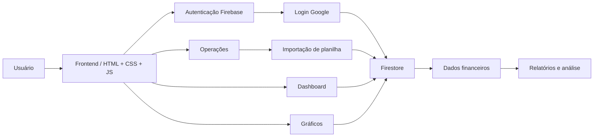

```mermaid
flowchart LR
    U[Usuário] --> P[Frontend / HTML + CSS + JS]
    P --> A[Autenticação Firebase]
    P --> D[Dashboard]
    P --> O[Operações]
    P --> G[Gráficos]

    A --> L[Login Google]
    L --> F[Firestore]

    O --> I[Importação de planilha]
    I --> F
    D --> F
    G --> F

    F --> R[Dados financeiros]
    R --> B[Relatórios e análise]
```